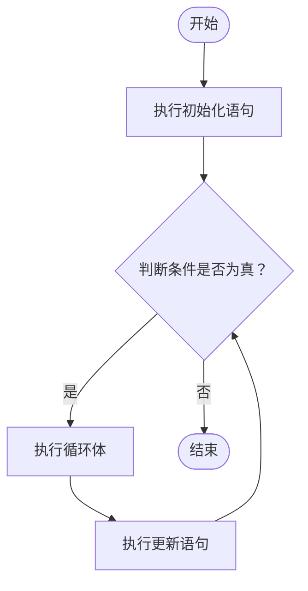

for 也是算法中一个重要部分。接下来以在 Go 中打印出九九乘法表为例

# 要求

输出：

```text
1
2 4
3 6 9
4 8 12 16
5 10 15 20 25
6 12 18 24 30 36
7 14 21 28 35 42 49
8 16 24 32 40 48 56 64
9 18 27 36 45 54 63 72 81 
```

# 思路

在 Go 中提供了循环，接下来以 C 中的循环进行类比：

```c
for(init,condition,update){
    ...
}
```



> 此处代码来自 [OI-Wiki](https://oi-wiki.org/lang/loop/#for-%E8%AF%AD%E5%8F%A5)

事实上，Go 的 `for` 中三个参数和 C 的**完全一致**，如果不理解 `init`,`condition`,和`update`，可以前往上方 OI-Wiki 参阅。不同的只是**去掉了圆括号，大括号不能换行**。

## 实现

```go
package main

import "fmt"

func main() {

    for i := 1; i <= 9; i++ {

        for j := 1; j <= i; j++ {
            // 每个数字前加空格（第一个除外），实现空格分隔
            if j > 1 {
                fmt.Print(" ")
            }
            fmt.Print(i * j)

        }

        fmt.Println() // 每行结束后换行
    }
}
```

# 参考

- [菜鸟教程](https://www.runoob.com/go/go-for-loop.html)