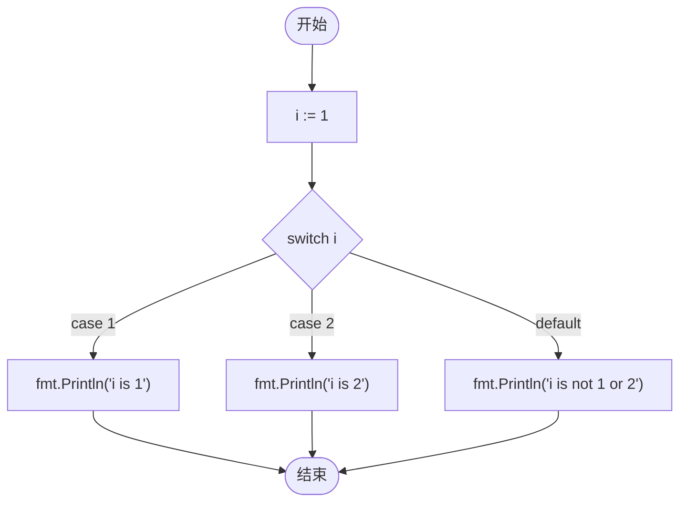

# 引入

<Info>
  Switch 句型是一类实用句型，根据不同条件执行不同操作。可以用来替换 `if-else` 句型
</Info>

# 示例

如下方：

```go
func main() {
    var i int = 1

    switch i {
        case 1:
        fmt.Println("i is 1")
        case 2:
        fmt.Println("i is 2")
        default:
        fmt.Println("i is not 1 or 2")
    }
}
```

在这里，变量 `i` 被 switch 语句进行判断，其执行过程如下：



# `fallthrough` 的使用

Go 的 `switch` 默认匹配到 `case` 执行后自动退出。加上 `fallthrough` 后，会**强制执行下一个 `case` 的代码块**（且不判断下一个 `case` 的条件）。